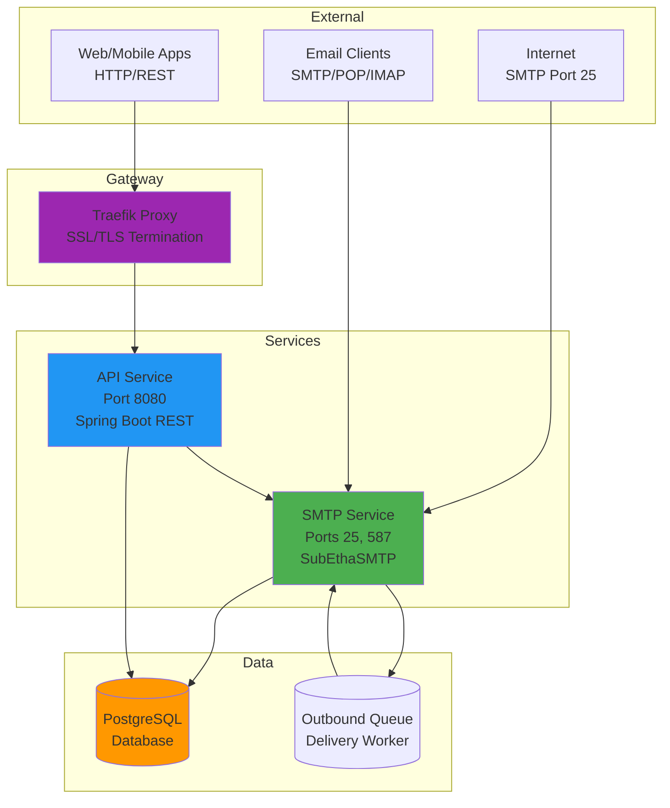
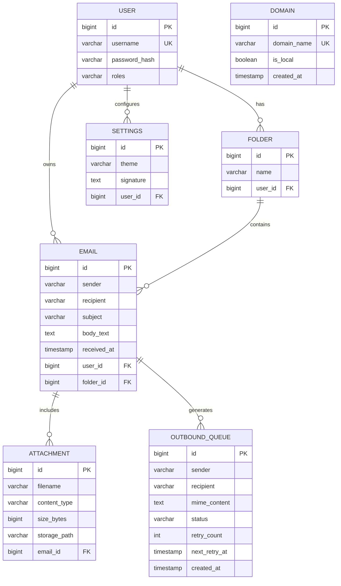

# SMTP Service / Mail Server Platform

> A robust, self-hosted email server platform built with Java Spring Boot, designed for complete email infrastructure control with production-ready features including SMTP, REST API, DKIM signing, and automated delivery queue.

[](https://www.oracle.com/java/)
[](https://spring.io/projects/spring-boot)
[](https://www.postgresql.org/)
[](LICENSE)

---

## 📋 Table of Contents

- [Overview](#-overview)
- [Key Features](#-key-features)
- [Architecture](#%EF%B8%8F-architecture)
- [Technology Stack](#%EF%B8%8F-technology-stack)
- [Project Structure](#-project-structure)
- [Prerequisites](#-prerequisites)
- [Installation](#-installation)
- [Configuration](#%EF%B8%8F-configuration)
- [Running the Application](#-running-the-application)
- [API Documentation](#-api-documentation)
- [Database Schema](#%EF%B8%8F-database-schema)
- [Testing](#-testing)
- [Deployment](#-deployment)
- [Troubleshooting](#-troubleshooting)
- [Contributing](#-contributing)
- [Contact](#-contact)

---

## 🎯 Overview

**SMTP Service** is a production-grade, self-hosted email server platform that provides complete control over your email infrastructure. It eliminates dependence on third-party email providers by offering a comprehensive solution for handling both inbound and outbound email traffic with enterprise-level features.

The system features:
- **Custom SMTP Server** for standard email protocol interoperability
- **RESTful API** for building custom email clients and administration
- **Microservices Architecture** using Java Spring Boot
- **Full Containerization** with Docker for easy deployment

Perfect for organizations requiring:
- Privacy and data sovereignty
- Custom email workflows
- Integration with existing systems
- Complete audit trails
- Scalable email infrastructure

---

## ✨ Key Features

### Email Handling
- 🔵 **SMTP Server** - SubEthaSMTP-based server handling ports 25 (inbound) and 587 (submission) with STARTTLS
- 📨 **Message Parsing** - Jakarta Mail integration for MIME message processing
- 📂 **Folder Management** - User-defined folders for email organization
- 📎 **Attachment Support** - Full attachment storage and retrieval

### Security & Authentication
- 🔐 **JWT Authentication** - Token-based API authentication using JJWT
- 🔑 **BCrypt Password Hashing** - Secure password storage
- 🔒 **TLS/STARTTLS** - Encrypted connections for SMTP
- ✍️ **DKIM Signing** - Outbound email authentication

### Delivery & Reliability
- 🚀 **Outbound Queue** - Asynchronous email delivery with retry logic
- 🔎 **MX Lookup** - DNS-based mail server discovery
- ⏱️ **Retry Mechanism** - Exponential backoff for failed deliveries
- 📊 **Queue Monitoring** - Scheduled workers for queue processing

### API & Integration
- 🌐 **RESTful API** - Comprehensive HTTP API for all operations
- 📖 **OpenAPI/Swagger** - Interactive API documentation
- 🩺 **Health Monitoring** - Spring Boot Actuator integration
- 📈 **Metrics** - Prometheus-compatible metrics export

### Infrastructure
- 🗄️ **PostgreSQL Storage** - Persistent data storage
- 🐳 **Docker Compose** - Complete containerized deployment
- 🔄 **Traefik Gateway** - Reverse proxy with auto-HTTPS (Let's Encrypt)
- 📝 **Log4j2 Logging** - Structured logging with rolling file appenders

---

## 🏗️ Architecture

The system follows a microservices architecture with three main components:



### Component Roles

| Component | Responsibility | Technology |
|-----------|---------------|------------|
| **SMTP Service** | Receives emails, parses MIME, manages outbound queue | SubEthaSMTP, Jakarta Mail |
| **API Service** | Provides REST API, handles authentication, user management | Spring Boot, Spring Security |
| **Database** | Stores users, emails, folders, queue, settings | PostgreSQL 15 |
| **Traefik** | Reverse proxy, SSL termination, routing | Traefik v2.10 |

---

## 🛠️ Technology Stack

### Core Technologies
- **Language**: Java 17
- **Framework**: Spring Boot 3.2.0
- **Build Tool**: Maven 3.9+
- **Database**: PostgreSQL 15
- **Containerization**: Docker & Docker Compose

### Key Dependencies

#### SMTP Service Module
| Dependency | Version | Purpose |
|-----------|---------|---------|
| SubEthaSMTP | 7.0.1 | SMTP server implementation |
| Simple Java Mail | 8.1.3 | Email sending utilities |
| Jakarta Mail API | 2.1.2 | Email message parsing |
| DNSJava | 3.5.2 | MX record lookup |
| Spring Data JPA | 3.2.0 | Data persistence |
| Log4j2 | (via Spring Boot) | Logging framework |

#### API Service Module
| Dependency | Version | Purpose |
|-----------|---------|---------|
| Spring Boot Web | 3.2.0 | REST API framework |
| Spring Security | 3.2.0 | Authentication & authorization |
| JJWT | 0.11.5 | JWT token handling |
| SpringDoc OpenAPI | 2.3.0 | API documentation (Swagger) |
| Spring Boot Actuator | 3.2.0 | Monitoring & metrics |
| Testcontainers | Latest | Integration testing |
| GreenMail | 2.0.0 | Email testing |

#### Common Module
- Spring Data JPA - Entity definitions
- Lombok - Code generation
- PostgreSQL Driver - Database connectivity

---

## 📂 Project Structure

```
smtp-service/
├── .github/                        # GitHub workflows (CI/CD)
├── api-service/                    # REST API Module
│   ├── src/main/java/com/example/api/
│   │   ├── config/                 # SecurityConfig, OpenApiConfig
│   │   ├── controller/             # REST Controllers
│   │   │   ├── AuthController.java         # /api/auth/*
│   │   │   ├── EmailController.java        # /api/emails/*
│   │   │   ├── FolderController.java       # /api/folders/*
│   │   │   ├── SettingsController.java     # /api/settings/*
│   │   │   └── AdminController.java        # /api/admin/*
│   │   ├── dto/                    # Data Transfer Objects
│   │   │   ├── EmailRequest.java
│   │   │   ├── LoginRequest.java
│   │   │   └── LoginResponse.java
│   │   ├── security/               # JWT & Security
│   │   │   ├── JwtUtil.java
│   │   │   └── JwtAuthenticationFilter.java
│   │   ├── service/                # Business Logic
│   │   │   └── UserService.java
│   │   └── ApiServiceApplication.java
│   ├── src/main/resources/
│   │   └── application.properties  # API configuration
│   ├── src/test/                   # API tests
│   └── pom.xml                     # API dependencies
├── smtp-service/                   # SMTP Server Module
│   ├── src/main/java/com/example/smtp/
│   │   ├── config/                 # SmtpServerConfig
│   │   ├── handler/                # SMTP message handlers
│   │   │   ├── MailHandler.java
│   │   │   └── MailHandlerFactory.java
│   │   ├── service/                # Email services
│   │   │   ├── DeliveryService.java        # Outbound delivery
│   │   │   ├── DkimSigningService.java     # DKIM signatures
│   │   │   └── MxLookupService.java        # DNS lookups
│   │   ├── security/               # DKIM utilities
│   │   │   └── DkimSignerUtil.java
│   │   ├── worker/                 # Background workers
│   │   │   └── QueueWorker.java            # Queue processor
│   │   ├── util/                   # Utilities
│   │   │   └── RateLimiter.java
│   │   └── SmtpServiceApplication.java
│   ├── src/main/resources/
│   │   ├── application.properties  # SMTP configuration
│   │   ├── log4j2.properties       # Logging config
│   │   └── keystore.jks            # TLS certificate
│   └── pom.xml                     # SMTP dependencies
├── common/                         # Shared Module
│   ├── src/main/java/com/example/common/
│   │   ├── entity/                 # JPA Entities
│   │   │   ├── User.java
│   │   │   ├── Email.java
│   │   │   ├── Folder.java
│   │   │   ├── Attachment.java
│   │   │   ├── OutboundQueue.java
│   │   │   ├── Settings.java
│   │   │   └── Domain.java
│   │   └── repository/             # Data Repositories
│   │       ├── UserRepository.java
│   │       ├── EmailRepository.java
│   │       ├── FolderRepository.java
│   │       ├── AttachmentRepository.java
│   │       ├── OutboundQueueRepository.java
│   │       ├── SettingsRepository.java
│   │       └── DomainRepository.java
│   └── pom.xml                     # Common dependencies
├── database/                       # Database scripts
├── dkim/                          # DKIM keys (private.key, public.key)
├── logs/                          # Application logs
├── proxy/                         # Proxy configurations
├── .env                           # Environment variables (not in git)
├── .env.example                   # Environment template
├── .gitignore                     # Git ignore rules
├── docker-compose.yml             # Container orchestration
├── Dockerfile.api                 # API container
├── Dockerfile.smtp                # SMTP container
├── pom.xml                        # Parent POM
├── README.md                      # This file
├── send_test_email.py             # Testing script
├── run_services.ps1               # Windows: Run both services
├── open_ports.ps1                 # Windows: Open firewall ports
├── close_ports.ps1                # Windows: Close firewall ports
└── smtp-service.service           # Linux: systemd service
```

---

## ✅ Prerequisites

Before installing, ensure you have:

### Required
- ☕ **Java 17 JDK** - [Download](https://adoptium.net/)
- 📦 **Maven 3.9+** - [Download](https://maven.apache.org/download.cgi)
- 🐳 **Docker** & **Docker Compose** - [Download](https://www.docker.com/products/docker-desktop/)
- 🔧 **Git** - [Download](https://git-scm.com/downloads)

### Development (Optional)
- 💻 **IDE**: IntelliJ IDEA, Eclipse, or VS Code
- 🔍 **PostgreSQL Client**: pgAdmin, DBeaver (for database browsing)

### Verify Installation
```bash
java -version      # Should show Java 17+
mvn -version       # Should show Maven 3.9+
docker --version   # Should show Docker 20+
git --version      # Should show Git 2.x
```

---

## 📥 Installation

### 1. Clone the Repository
```bash
git clone https://github.com/1prabhakarpal/smtp-service.git
cd smtp-service
```

### 2. Build the Project
```bash
# Build all modules (common, smtp-service, api-service)
mvn clean install

# Skip tests during build (faster)
mvn clean install -DskipTests
```

This will:
- Compile Java sources
- Run unit tests
- Package JARs for each module
- Install artifacts to local Maven repository

### 3. Generate DKIM Keys
DKIM signing requires RSA key pair:

```bash
# Create DKIM directory
mkdir -p dkim

# Generate private key (2048-bit RSA)
openssl genrsa -out dkim/private.key 2048

# Extract public key
openssl rsa -in dkim/private.key -pubout -out dkim/public.key

# Display public key for DNS (remove headers and newlines)
sed '1d;$d' dkim/public.key | tr -d '\n' && echo
```

**Save the public key output** - you'll add it to your DNS as a TXT record:
```
default._domainkey.yourdomain.com TXT "v=DKIM1; k=rsa; p=YOUR_PUBLIC_KEY_HERE"
```

---

## ⚙️ Configuration

### Environment Variables

Copy the example environment file:
```bash
cp .env.example .env
```

Edit `.env` with your configuration:

```env
# Database Configuration
DB_USER=mailuser
DB_PASSWORD=securepassword      # Change in production!
DB_NAME=maildb

# Domain Configuration
DOMAIN=yourdomain.com            # Your mail domain
API_DOMAIN=api.yourdomain.com    # API subdomain
ACME_EMAIL=admin@yourdomain.com  # Let's Encrypt notifications

# DKIM Configuration
DKIM_SELECTOR=default            # Matches DNS record

# JWT Configuration (generate with: openssl rand -hex 32)
JWT_SECRET=your_64_character_hex_secret_here
JWT_EXPIRATION_MS=86400000       # 24 hours
```

### Application Properties

#### SMTP Service (`smtp-service/src/main/resources/application.properties`)
```properties
# SMTP Server Ports
smtp.port=25000           # Local testing: 25000, Production: 25
smtp.submission.port=58700 # Local testing: 58700, Production: 587

# DKIM Settings
dkim.signing.domain=yourdomain.com
dkim.signing.selector=default
dkim.private.key.path=dkim/private.key

# Queue Worker Settings
queue.worker.fixed.delay=10000      # Process queue every 10s
queue.worker.batch.size=10          # Process 10 emails per batch
queue.retry.max.attempts=5          # Retry failed emails 5 times
queue.retry.backoff.factor=2        # Exponential backoff
```

#### API Service (`api-service/src/main/resources/application.properties`)
```properties
# Server Configuration
server.port=8095          # Local: 8095, Docker: 8080

# JWT Configuration (uses .env values)
app.jwt.secret=${JWT_SECRET}
app.jwt.expiration-ms=${JWT_EXPIRATION_MS}

# Mail Configuration
spring.mail.host=localhost
spring.mail.port=25       # Connect to SMTP service
```

### DNS Configuration

For production deployment, configure these DNS records:

| Type | Name | Value | Purpose |
|------|------|-------|---------|
| A | `@` | `your.server.ip` | Domain root |
| A | `api` | `your.server.ip` | API subdomain |
| MX | `@` | `10 mail.yourdomain.com` | Mail routing |
| A | `mail` | `your.server.ip` | Mail server |
| TXT | `@` | `v=spf1 mx ~all` | SPF record |
| TXT | `default._domainkey` | `v=DKIM1; k=rsa; p=YOUR_PUBLIC_KEY` | DKIM record |
| TXT | `_dmarc` | `v=DMARC1; p=quarantine; rua=mailto:dmarc@yourdomain.com` | DMARC policy |

---

## 🚀 Running the Application

### Option 1: Docker Compose (Recommended)

Start the entire stack with one command:

```bash
# Build and start all services
docker-compose up -d --build

# View logs
docker-compose logs -f

# Stop all services
docker-compose down
```

**Services Started:**
- `postgres` → PostgreSQL database (port 5432)
- `smtp-service` → SMTP server (ports 25, 587)
- `api-service` → REST API (port 8080)
- `traefik` → Reverse proxy (ports 80, 443, 8081)

**Access Points:**
- API: `http://localhost:8080` or `https://api.yourdomain.com`
- Traefik Dashboard: `http://localhost:8081`
- PostgreSQL: `localhost:5432`
- SMTP: `localhost:25` and `localhost:587`

### Option 2: Local Development (Windows)

Use the PowerShell script to run both services:

```powershell
# Run both SMTP and API services
.\run_services.ps1

# Open Windows Firewall ports (run as Administrator)
.\open_ports.ps1

# Close ports when done
.\close_ports.ps1
```

### Option 3: Manual Local Development

**Terminal 1 - Start PostgreSQL:**
```bash
docker run -d --name postgres \
  -e POSTGRES_USER=mailuser \
  -e POSTGRES_PASSWORD=securepassword \
  -e POSTGRES_DB=maildb \
  -p 5432:5432 \
  postgres:15-alpine
```

**Terminal 2 - Run SMTP Service:**
```bash
cd smtp-service
mvn spring-boot:run
```

**Terminal 3 - Run API Service:**
```bash
cd api-service
mvn spring-boot:run
```

### Option 4: Linux systemd Service

Install as a system service on Linux:

```bash
# Copy service file
sudo cp smtp-service.service /etc/systemd/system/

# Edit paths in service file
sudo nano /etc/systemd/system/smtp-service.service

# Enable and start
sudo systemctl enable smtp-service
sudo systemctl start smtp-service

# Check status
sudo systemctl status smtp-service

# View logs
sudo journalctl -u smtp-service -f
```

---

## 📖 API Documentation

### Interactive Documentation

Once the API service is running, access Swagger UI:
```
http://localhost:8095/swagger-ui.html
```

### Authentication Endpoints

#### Register User
```http
POST /api/auth/signup
Content-Type: application/json

{
  "username": "john",
  "email": "john@example.com",
  "password": "securePassword123"
}
```

**Response (201 Created):**
```json
{
  "message": "User registered successfully"
}
```

#### Login
```http
POST /api/auth/signin
Content-Type: application/json

{
  "username": "john",
  "password": "securePassword123"
}
```

**Response (200 OK):**
```json
{
  "token": "eyJhbGciOiJIUzI1NiIsInR5cCI6IkpXVCJ9...",
  "type": "Bearer",
  "username": "john",
  "expiresIn": 86400000
}
```

### Email Endpoints

All email endpoints require `Authorization: Bearer <token>` header.

#### List Emails
```http
GET /api/emails?page=0&size=20&folderId=1
Authorization: Bearer eyJhbGci...
```

**Response (200 OK):**
```json
{
  "content": [
    {
      "id": 1,
      "sender": "alice@example.com",
      "recipient": "john@yourdomain.com",
      "subject": "Hello",
      "body": "Email content here",
      "receivedAt": "2024-11-29T10:30:00",
      "folder": {
        "id": 1,
        "name": "Inbox"
      }
    }
  ],
  "totalElements": 42,
  "totalPages": 3,
  "number": 0,
  "size": 20
}
```

#### Get Single Email
```http
GET /api/emails/1
Authorization: Bearer eyJhbGci...
```

#### Send Email
```http
POST /api/emails
Authorization: Bearer eyJhbGci...
Content-Type: application/json

{
  "to": "recipient@example.com",
  "subject": "Meeting Tomorrow",
  "body": "Let's meet at 10 AM"
}
```

**Response (201 Created):**
```json
{
  "id": 5,
  "status": "QUEUED",
  "message": "Email queued for delivery"
}
```

#### Delete Email
```http
DELETE /api/emails/1
Authorization: Bearer eyJhbGci...
```

### Folder Endpoints

#### List Folders
```http
GET /api/folders
Authorization: Bearer eyJhbGci...
```

**Response:**
```json
[
  {
    "id": 1,
    "name": "Inbox",
    "emailCount": 42
  },
  {
    "id": 2,
    "name": "Sent",
    "emailCount": 18
  }
]
```

#### Create Folder
```http
POST /api/folders
Authorization: Bearer eyJhbGci...
Content-Type: application/json

{
  "name": "Work Projects"
}
```

#### Move Email to Folder
```http
POST /api/emails/1/move?folderId=2
Authorization: Bearer eyJhbGci...
```

### Admin Endpoints

#### Get System Stats
```http
GET /api/admin/stats
Authorization: Bearer eyJhbGci...
X-Role: ADMIN
```

**Response:**
```json
{
  "totalUsers": 150,
  "totalEmails": 5420,
  "queuedEmails": 3,
  "failedEmails": 1,
  "diskUsage": "2.4 GB"
}
```

### Health & Metrics

#### Health Check
```http
GET /actuator/health
```

**Response:**
```json
{
  "status": "UP",
  "components": {
    "db": {
      "status": "UP",
      "details": {
        "database": "PostgreSQL",
        "validationQuery": "isValid()"
      }
    },
    "diskSpace": {
      "status": "UP",
      "details": {
        "total": 500000000000,
        "free": 250000000000,
        "threshold": 10485760
      }
    }
  }
}
```

#### Metrics
```http
GET /actuator/metrics
GET /actuator/prometheus
```

---

## 🗄️ Database Schema

### Entity Relationship Diagram



### Table Descriptions

#### `users` - User Accounts
| Column | Type | Description |
|--------|------|-------------|
| id | BIGSERIAL PRIMARY KEY | User ID |
| username | VARCHAR(255) UNIQUE NOT NULL | Login username |
| password_hash | VARCHAR(255) NOT NULL | BCrypt hashed password |
| roles | VARCHAR(50) DEFAULT 'USER' | Comma-separated roles |

#### `emails` - Email Messages
| Column | Type | Description |
|--------|------|-------------|
| id | BIGSERIAL PRIMARY KEY | Email ID |
| sender | VARCHAR(255) | From address |
| recipient | VARCHAR(255) | To address |
| subject | VARCHAR(500) | Email subject |
| body_text | TEXT | Email body content |
| received_at | TIMESTAMP DEFAULT NOW() | Reception timestamp |
| user_id | BIGINT FK → users(id) | Owner user |
| folder_id | BIGINT FK → folders(id) | Containing folder |

#### `folders` - Email Folders
| Column | Type | Description |
|--------|------|-------------|
| id | BIGSERIAL PRIMARY KEY | Folder ID |
| name | VARCHAR(100) NOT NULL | Folder name |
| user_id | BIGINT FK → users(id) | Owner user |

#### `attachments` - Email Attachments
| Column | Type | Description |
|--------|------|-------------|
| id | BIGSERIAL PRIMARY KEY | Attachment ID |
| filename | VARCHAR(255) | Original filename |
| content_type | VARCHAR(100) | MIME type |
| size_bytes | BIGINT | File size |
| storage_path | VARCHAR(500) | Disk location |
| email_id | BIGINT FK → emails(id) | Parent email |

#### `outbound_queue` - Delivery Queue
| Column | Type | Description |
|--------|------|-------------|
| id | BIGSERIAL PRIMARY KEY | Queue entry ID |
| sender | VARCHAR(255) | From address |
| recipient | VARCHAR(255) | To address |
| mime_content | TEXT | Full MIME message |
| status | VARCHAR(20) | PENDING/SENDING/SUCCESS/FAILED |
| retry_count | INT DEFAULT 0 | Attempt counter |
| next_retry_at | TIMESTAMP | Next retry time |
| created_at | TIMESTAMP DEFAULT NOW() | Queue entry time |

#### `settings` - User Preferences
| Column | Type | Description |
|--------|------|-------------|
| id | BIGSERIAL PRIMARY KEY | Settings ID |
| theme | VARCHAR(20) DEFAULT 'light' | UI theme |
| signature | TEXT | Email signature |
| user_id | BIGINT FK → users(id) | Owner user |

#### `domains` - Accepted Domains
| Column | Type | Description |
|--------|------|-------------|
| id | BIGSERIAL PRIMARY KEY | Domain ID |
| domain_name | VARCHAR(255) UNIQUE | Domain (e.g., yourdomain.com) |
| is_local | BOOLEAN DEFAULT TRUE | Handle locally? |
| created_at | TIMESTAMP DEFAULT NOW() | Registration time |

---

## 🧪 Testing

### Running Tests

```bash
# Run all tests (unit + integration)
mvn test

# Run tests for specific module
mvn test -pl api-service
mvn test -pl smtp-service
mvn test -pl common

# Run specific test class
mvn test -Dtest=EmailControllerTest -pl api-service

# Run with coverage report
mvn test jacoco:report

# Skip tests during build
mvn clean install -DskipTests
```

### Test Categories

#### Unit Tests
- `*Test.java` - Fast, isolated unit tests
- Mock external dependencies
- Test business logic in services

#### Integration Tests
- `*IntegrationTest.java` - Test with real database
- Use Testcontainers for PostgreSQL
- Test repository layer

#### E2E Tests
- `*E2ETest.java` - Full system tests
- Test complete workflows
- Use GreenMail for SMTP testing

### Manual Testing with Python Script

Test SMTP server manually:

```bash
python send_test_email.py
```

Edit `send_test_email.py` to customize:
```python
sender = "test@example.com"
recipient = "you@yourdomain.com"
smtp_host = "localhost"
smtp_port = 25000  # or 587 for submission
```

### Testing with Telnet

Test SMTP server manually:
```bash
telnet localhost 25000
EHLO localhost
MAIL FROM:<sender@example.com>
RCPT TO:<recipient@yourdomain.com>
DATA
Subject: Test
From: sender@example.com
To: recipient@yourdomain.com

Test message body.
.
QUIT
```

### Testing API with cURL

```bash
# Register user
curl -X POST http://localhost:8095/api/auth/signup \
  -H "Content-Type: application/json" \
  -d '{"username":"test","email":"test@test.com","password":"password123"}'

# Login
TOKEN=$(curl -s -X POST http://localhost:8095/api/auth/signin \
  -H "Content-Type: application/json" \
  -d '{"username":"test","password":"password123"}' \
  | jq -r .token)

# List emails
curl -X GET http://localhost:8095/api/emails \
  -H "Authorization: Bearer $TOKEN"

# Send email
curl -X POST http://localhost:8095/api/emails \
  -H "Authorization: Bearer $TOKEN" \
  -H "Content-Type: application/json" \
  -d '{"to":"recipient@example.com","subject":"Test","body":"Hello!"}'
```

---

## 🚢 Deployment

### Docker Deployment (Production)

1. **Prepare Server**:
   - Linux VM with Docker installed (Ubuntu 22.04 recommended)
   - Public IP address
   - Open ports: 25, 80, 443, 587

2. **Clone Repository**:
   ```bash
   git clone https://github.com/1prabhakarpal/smtp-service.git
   cd smtp-service
   ```

3. **Configure Environment**:
   ```bash
   cp .env.example .env
   nano .env
   ```

4. **Generate DKIM Keys** (see Installation section)

5. **Configure DNS** (see Configuration section)

6. **Start Services**:
   ```bash
   docker-compose up -d --build
   ```

7. **Verify Deployment**:
   ```bash
   # Check service status
   docker-compose ps

   # Check health
   curl http://localhost:8080/actuator/health

   # View logs
   docker-compose logs -f smtp-service
   docker-compose logs -f api-service
   ```

### Cloud Platform Deployment

#### AWS EC2
1. Launch EC2 instance (t3.medium or larger)
2. Security Group: Allow ports 22, 25, 80, 443, 587
3. Associate Elastic IP
4. Install Docker:
   ```bash
   sudo yum update -y
   sudo yum install docker -y
   sudo service docker start
   sudo usermod -a -G docker ec2-user
   ```

#### DigitalOcean Droplet
1. Create Droplet (Ubuntu 22.04, 2 vCPU, 4GB RAM)
2. Add Firewall rules for ports 25, 80, 443, 587
3. Install Docker using convenience script:
   ```bash
   curl -fsSL https://get.docker.com -o get-docker.sh
   sh get-docker.sh
   ```

### Environment-Specific Configurations

#### Production `.env`
```env
DB_PASSWORD=<strong-random-password>
JWT_SECRET=<64-character-hex-secret>
DOMAIN=mail.yourdomain.com
API_DOMAIN=api.yourdomain.com
ACME_EMAIL=admin@yourdomain.com
```

#### Production SMTP Ports
Edit `docker-compose.yml`:
```yaml
smtp-service:
  ports:
    - "25:25"      # Change from 25:25000
    - "587:587"    # Change from 587:58700
  environment:
    SMTP_PORT: 25
    SMTP_SUBMISSION_PORT: 587
```

### Monitoring & Maintenance

#### View Logs
```bash
# All services
docker-compose logs -f

# Specific service
docker-compose logs -f smtp-service

# Last 100 lines
docker-compose logs --tail=100 smtp-service
```

#### Backup Database
```bash
# Create backup
docker exec postgres pg_dump -U mailuser maildb > backup_$(date +%Y%m%d).sql

# Restore backup
cat backup_20241129.sql | docker exec -i postgres psql -U mailuser maildb
```

#### Update Application
```bash
git pull origin main
docker-compose down
docker-compose up -d --build
```

---

## ❓ Troubleshooting

### Common Issues

#### Port 25 Blocked by ISP
**Symptom**: Cannot receive emails from external servers

**Solution**:
1. Check if port 25 is open:
   ```bash
   telnet yourdomain.com 25
   ```
2. If blocked, contact ISP to request unblocking
3. Alternative: Use email relay service (SendGrid, Mailgun)
4. Configure relay in `application.properties`:
   ```properties
   relay.host=smtp.sendgrid.net
   relay.port=587
   relay.username=apikey
   relay.password=your_api_key
   ```

#### Emails Going to Spam
**Symptom**: Sent emails land in recipient spam folders

**Solution**:
1. Verify DNS records (SPF, DKIM, DMARC):
   ```bash
   dig TXT yourdomain.com
   dig TXT default._domainkey.yourdomain.com
   dig TXT _dmarc.yourdomain.com
   ```
2. Test email deliverability:
   - https://www.mail-tester.com
   - https://mxtoolbox.com
3. Warm up IP address (send low volumes initially)
4. Ensure reverse DNS (PTR record) is set

#### Database Connection Failed
**Symptom**: `Connection refused` or `Authentication failed`

**Solution**:
1. Check PostgreSQL is running:
   ```bash
   docker-compose ps postgres
   ```
2. Verify credentials in `.env` match `docker-compose.yml`
3. Check database logs:
   ```bash
   docker-compose logs postgres
   ```
4. Test connection:
   ```bash
   docker exec -it postgres psql -U mailuser -d maildb
   ```

#### OutOfMemory Errors
**Symptom**: Java heap space errors in logs

**Solution**:
1. Increase JVM memory in Dockerfile:
   ```dockerfile
   ENTRYPOINT ["java", "-Xmx2g", "-Xms512m", "-jar", "app.jar"]
   ```
2. Or in `docker-compose.yml`:
   ```yaml
   smtp-service:
     environment:
       JAVA_OPTS: "-Xmx2g -Xms512m"
   ```

#### DKIM Signature Verification Failed
**Symptom**: Recipient servers reject DKIM signatures

**Solution**:
1. Verify DNS TXT record:
   ```bash
   dig TXT default._domainkey.yourdomain.com
   ```
2. Ensure public key format is correct (no newlines, no headers)
3. Check private key file permissions:
   ```bash
   chmod 600 dkim/private.key
   ```
4. Test DKIM setup: https://dkimvalidator.com

#### Queue Worker Not Processing
**Symptom**: Emails stuck in outbound queue

**Solution**:
1. Check worker logs:
   ```bash
   docker-compose logs -f smtp-service | grep QueueWorker
   ```
2. Verify worker is enabled:
   ```properties
   @EnableScheduling  # In SmtpServiceApplication.java
   ```
3. Check retry configuration:
   ```properties
   queue.retry.max.attempts=5
   ```
4. Manually trigger processing (for debugging):
   ```bash
   curl -X POST http://localhost:8081/actuator/scheduledtasks
   ```

### Debug Mode

Enable debug logging:

**`application.properties`**:
```properties
logging.level.com.example=DEBUG
logging.level.org.springframework=INFO
logging.level.org.hibernate.SQL=DEBUG
```

**View debug logs**:
```bash
docker-compose logs -f | grep DEBUG
```

### Performance Tuning

#### Database Connection Pool
```properties
# In application.properties
spring.datasource.hikari.maximum-pool-size=20
spring.datasource.hikari.minimum-idle=5
spring.datasource.hikari.connection-timeout=30000
```

#### Queue Worker Optimization
```properties
# Process more emails per batch
queue.worker.batch.size=50

# Reduce delay between batches
queue.worker.fixed.delay=5000
```

---

## 🤝 Contributing

We welcome contributions! Please follow these guidelines:

### How to Contribute

1. **Fork the Repository**
   ```bash
   git clone https://github.com/your-username/smtp-service.git
   cd smtp-service
   git remote add upstream https://github.com/1prabhakarpal/smtp-service.git
   ```

2. **Create Feature Branch**
   ```bash
   git checkout -b feature/amazing-feature
   ```

3. **Make Changes**
   - Follow existing code style
   - Add tests for new features
   - Update documentation

4. **Commit Changes**
   ```bash
   git add .
   git commit -m "feat: Add amazing feature"
   ```

   **Commit Message Format**:
   - `feat:` New feature
   - `fix:` Bug fix
   - `docs:` Documentation changes
   - `style:` Code style changes
   - `refactor:` Code refactoring
   - `test:` Test additions/changes
   - `chore:` Build/tooling changes

5. **Push to Fork**
   ```bash
   git push origin feature/amazing-feature
   ```

6. **Open Pull Request**
   - Go to GitHub repository
   - Click "New Pull Request"
   - Describe your changes
   - Link related issues

### Development Guidelines

- **Code Style**: Follow Java conventions, use Lombok annotations
- **Testing**: Maintain 80%+ code coverage
- **Documentation**: Update README/Javadocs for public APIs
- **Commits**: Keep commits atomic and well-described

### Reporting Issues

Use GitHub Issues with these templates:

**Bug Report**:
```markdown
**Describe the bug**
A clear description of the bug

**To Reproduce**
Steps to reproduce the behavior

**Expected behavior**
What you expected to happen

**Environment**
- OS: [e.g., Ubuntu 22.04]
- Java Version: [e.g., 17]
- Docker Version: [e.g., 24.0.6]
```

**Feature Request**:
```markdown
**Feature description**
Clear description of the feature

**Use case**
Why is this feature needed?

**Proposed solution**
How should it work?
```

---

##  Contact

### Maintainer
- **Name**: Prabhakar Pal
- **Email**: prabhakar.ms.pal@gmail.com
- **GitHub**: [@1prabhakarpal](https://github.com/1prabhakarpal)
- **LinkedIn**: [prabhakarpal](https://linkedin.com/in/prabhakarpal)

### Project Links
- **Repository**: https://github.com/1prabhakarpal/smtp-service
- **Issues**: https://github.com/1prabhakarpal/smtp-service/issues
- **Discussions**: https://github.com/1prabhakarpal/smtp-service/discussions

### Community
- 💬 Join our [Discord Server](#) (coming soon)
- 📧 Mailing List: smtp-service@groups.io (coming soon)

---

## 🙏 Acknowledgments

Special thanks to:
- [SubEthaSMTP](https://github.com/davidmoten/subethasmtp) - SMTP server library
- [Spring Boot](https://spring.io/projects/spring-boot) - Application framework
- [Jakarta Mail](https://eclipse-ee4j.github.io/mail/) - Email API
- [JJWT](https://github.com/jwtk/jjwt) - JWT library
- All contributors who have helped improve this project

---

## 📊 Project Stats


---

<div align="center">
  <p>Made with ❤️ by <a href="https://github.com/1prabhakarpal">Prabhakar Pal</a></p>
  <p>⭐ Star this repository if you find it helpful!</p>
</div>
